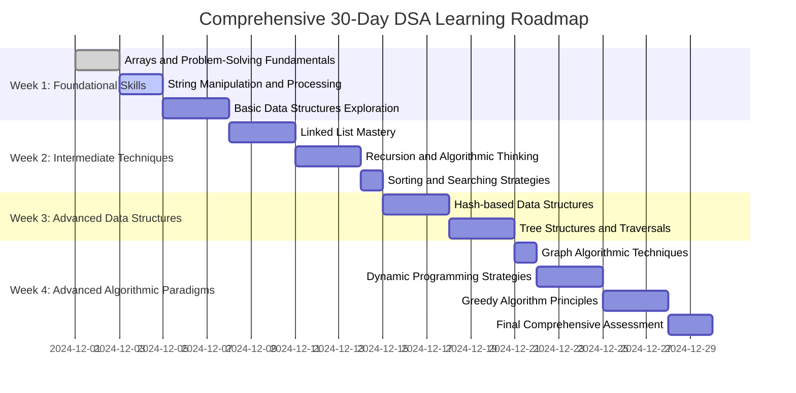

# 30-Day DSA Learning Roadmap: Comprehensive Guide with Prerequisite Knowledge

## Pre-Roadmap Preparation

### Fundamental Learning Rules:
1. No LLM/AI assistance for solving problems.
2. Solve problems independently.
3. Time-box problem-solving (45-60 minutes per problem).
4. Always draw out solutions on paper first.
5. Break down problems into smaller components.
6. Maintain a detailed problem-solving journal.

### Holistic Learning Approach:
- Completely understand the problem's context and requirements.
- Design a comprehensive solution on paper.
- Implement the solution methodically.
- Rigorously analyze and optimize time/space complexity.
- Systematically compare your solution with alternative approaches.

---

## Comprehensive Learning Roadmap Visualization

---

## Week 1: Foundational Skills and Basic Data Structures

### **Learning Objectives:**
- Develop robust problem-solving foundations.
- Master fundamental data structures: arrays, strings, stacks, queues.
- Build computational thinking and algorithmic reasoning skills.

### **Day 1-2: Arrays and Fundamental Problem-Solving**

#### **Prerequisite Knowledge:**
- Array memory representation
- Zero-based indexing principles
- Basic Big O notation understanding
- Programming language array manipulation techniques
- Computational complexity analysis

#### **Conceptual Learning Foundations:**
- Understand arrays as contiguous memory blocks
- Learn memory allocation strategies
- Practice efficient array traversal techniques
- Develop pattern recognition in array problems

#### **Practice Problems with Strategic Insights:**
1. **Two Sum (LeetCode 1)**
   - Hash map optimization techniques
   - Complement-based problem-solving
   - Space-time complexity trade-offs
   - Key Learning: One-pass hash table approach

2. **Remove Duplicates from Sorted Array (LeetCode 26)**
   - In-place modification strategies
   - Two-pointer technique mastery
   - Sorted array optimization principles
   - Key Learning: Minimal additional space usage

3. **Maximum Subarray (LeetCode 53)**
   - Kadane's algorithm introduction
   - Dynamic programming foundations
   - Continuous subarray tracking
   - Key Learning: Running sum management

4. **Move Zeroes (LeetCode 283)**
   - Two-pointer manipulation
   - Element swapping techniques
   - Maintaining element order
   - Key Learning: Efficient single-pass solution

### **Day 3-4: String Manipulation and Processing**

#### **Prerequisite Knowledge:**
- String representation internals
- Character encoding understanding
- String immutability concepts
- Basic string method comprehension
- ASCII and Unicode foundations

#### **Conceptual Learning Foundations:**
- Understand string as character arrays
- Learn efficient string traversal
- Master character-level manipulations
- Develop string preprocessing techniques

#### **Practice Problems with Strategic Insights:**
1. **Reverse String (LeetCode 344)**
   - In-place reversal technique
   - Two-pointer string manipulation
   - Minimal extra space strategy
   - Key Learning: Symmetric swapping

2. **Reverse Integer (LeetCode 7)**
   - Integer digit extraction methods
   - Overflow handling strategies
   - Mathematical digit manipulation
   - Key Learning: Digit-by-digit reversal

3. **Valid Palindrome (LeetCode 125)**
   - String cleaning techniques
   - Case-insensitive comparison
   - Non-alphanumeric character handling
   - Key Learning: Two-pointer palindrome verification

4. **Longest Common Prefix (LeetCode 14)**
   - Vertical scanning approach
   - String comparison strategies
   - Edge case management
   - Key Learning: Prefix matching algorithm

### **Day 5-7: Basic Data Structures - Stacks and Queues**

#### **Prerequisite Knowledge:**
- Abstract data type understanding
- LIFO and FIFO principles
- Stack and queue implementation details
- Operation complexity analysis
- Memory management concepts

#### **Conceptual Learning Foundations:**
- Understand stack and queue behavioral differences
- Learn implementation trade-offs
- Master operation efficiency
- Develop adaptive data structure thinking

#### **Practice Problems with Strategic Insights:**
1. **Valid Parentheses (LeetCode 20)**
   - Stack-based matching technique
   - Bracket pairing logic
   - Order preservation strategy
   - Key Learning: Stack for syntax validation

2. **Implement Stack using Queues (LeetCode 225)**
   - Multi-queue simulation
   - Amortized time complexity understanding
   - Advanced data structure transformation
   - Key Learning: Simulated abstract data type

3. **Implement Queue using Stacks (LeetCode 232)**
   - Reverse engineering data structures
   - Complex transformation strategies
   - Operational efficiency analysis
   - Key Learning: Flexible data structure implementation

4. **Min Stack (LeetCode 155)**
   - Auxiliary data structure management
   - Constant-time minimum tracking
   - Synchronized stack operations
   - Key Learning: Multilayer stack design

## Week 2: Intermediate Concepts and Advanced Problem-Solving

### **Learning Objectives:**
- Master linked list manipulation
- Develop recursive thinking
- Understand fundamental sorting and searching algorithms
- Build complex problem-solving skills
- Enhance algorithmic reasoning capabilities

### **Day 8-10: Linked Lists - Structural Mastery**

#### **Prerequisite Knowledge:**
- Pointer and reference concepts
- Dynamic memory allocation
- Node-based data structure understanding
- Memory management principles
- Traversal and manipulation techniques

#### **Conceptual Learning Foundations:**
- Understand linked lists as dynamic data structures
- Learn node interconnection mechanisms
- Master memory-efficient list operations
- Develop visualization skills for list transformations

#### **Practice Problems with Strategic Insights:**
1. **Reverse Linked List (LeetCode 206)**
   - In-place reversal techniques
   - Pointer redirection strategies
   - Recursive and iterative approach comparison
   - Key Learning: Systematic node relationship manipulation

2. **Linked List Cycle (LeetCode 141)**
   - Floyd's Cycle-Finding Algorithm (Tortoise and Hare)
   - Cycle detection strategies
   - Constant space complexity techniques
   - Key Learning: Pointer movement synchronization

3. **Merge Two Sorted Lists (LeetCode 21)**
   - Sorted list combination algorithms
   - Comparative element selection
   - Minimal additional space usage
   - Key Learning: Efficient merging strategy

4. **Palindrome Linked List (LeetCode 234)**
   - List traversal techniques
   - Reverse-in-place strategies
   - Complex list validation approaches
   - Key Learning: Multi-stage list analysis

### **Day 11-13: Recursion and Backtracking**

#### **Prerequisite Knowledge:**
- Call stack understanding
- Recursive function design
- Base case and recursive case identification
- Computational complexity of recursive algorithms
- Backtracking problem-solving paradigm

#### **Conceptual Learning Foundations:**
- Understand recursion as problem decomposition
- Learn recursive thinking patterns
- Master base case and recursive case design
- Develop mental model for recursive problem-solving

#### **Practice Problems with Strategic Insights:**
1. **Climbing Stairs (LeetCode 70)**
   - Dynamic programming foundations
   - Recursive solution optimization
   - Memoization techniques
   - Key Learning: Recursive state management

2. **Permutations (LeetCode 46)**
   - Backtracking algorithm design
   - Exhaustive combination generation
   - State space exploration
   - Key Learning: Recursive combination construction

3. **Subsets (LeetCode 78)**
   - Powerset generation techniques
   - Recursive subset creation
   - Combinatorial problem-solving
   - Key Learning: Systematic subset exploration

4. **Generate Parentheses (LeetCode 22)**
   - Constraint-based generation
   - Backtracking with validation
   - Systematic string construction
   - Key Learning: Recursive constraint management

### **Day 14: Sorting and Searching Fundamentals**

#### **Prerequisite Knowledge:**
- Comparison-based sorting algorithms
- Search algorithm design
- Time and space complexity analysis
- Algorithm stability concepts
- Divide and conquer strategies

#### **Conceptual Learning Foundations:**
- Understand sorting algorithm paradigms
- Learn efficient searching techniques
- Master algorithm selection strategies
- Develop comparative algorithm analysis skills

#### **Practice Problems with Strategic Insights:**
1. **Sort an Array (LeetCode 912)**
   - Multiple sorting algorithm implementations
   - Time complexity optimization
   - In-place vs. auxiliary sorting
   - Key Learning: Comprehensive sorting technique mastery

2. **Search in Rotated Sorted Array (LeetCode 33)**
   - Modified binary search technique
   - Pivot point identification
   - Efficient search in modified arrays
   - Key Learning: Advanced search space reduction

3. **Sqrt(x) (LeetCode 69)**
   - Binary search application
   - Approximation techniques
   - Precision management
   - Key Learning: Iterative approximation algorithm

4. **Search a 2D Matrix (LeetCode 74)**
   - Multi-dimensional search strategies
   - Efficient search space reduction
   - Matrix traversal optimization
   - Key Learning: Logical search space transformation
## Week 3: Advanced Data Structures Deep Dive

### **Learning Objectives:**
- Master hash-based data structures
- Develop complex tree manipulation skills
- Understand advanced data structure applications
- Build sophisticated problem-solving strategies
- Enhance algorithmic reasoning capabilities

### **Day 15-17: Hash Tables and Hash Map Mastery**

#### **Prerequisite Knowledge:**
- Hash function principles
- Collision resolution techniques
- Time complexity of hash-based operations
- Key-value pair storage mechanisms
- Memory allocation in hash structures

#### **Conceptual Learning Foundations:**
- Understand hash table internal workings
- Learn efficient mapping strategies
- Master collision handling techniques
- Develop deep hash-based problem-solving skills

#### **Practice Problems with Strategic Insights:**
1. **Valid Anagram (LeetCode 242)**
   - Character frequency mapping
   - Efficient string comparison techniques
   - Constant space optimization
   - Key Learning: Character counting strategy

2. **Group Anagrams (LeetCode 49)**
   - Advanced hash map utilization
   - String signature generation
   - Complex grouping algorithms
   - Key Learning: Categorical string mapping

3. **First Unique Character in a String (LeetCode 387)**
   - Single-pass character tracking
   - Efficient uniqueness verification
   - Optimal space complexity approaches
   - Key Learning: Character occurrence tracking

### **Day 18-20: Trees and Binary Search Trees**

#### **Prerequisite Knowledge:**
- Tree data structure fundamentals
- Recursive tree traversal techniques
- Binary search tree properties
- Tree balance concepts
- Recursive algorithm design

#### **Conceptual Learning Foundations:**
- Understand hierarchical data representation
- Learn tree structure manipulation
- Master recursive tree algorithms
- Develop spatial reasoning skills

#### **Practice Problems with Strategic Insights:**
1. **Maximum Depth of Binary Tree (LeetCode 104)**
   - Recursive depth calculation
   - Tree traversal strategies
   - Depth-first exploration techniques
   - Key Learning: Recursive tree measurement

2. **Validate Binary Search Tree (LeetCode 98)**
   - Complex constraint validation
   - Recursive range checking
   - Efficient tree property verification
   - Key Learning: Recursive interval management

3. **Lowest Common Ancestor of a Binary Tree (LeetCode 236)**
   - Advanced tree traversal
   - Ancestor identification techniques
   - Recursive path tracking
   - Key Learning: Sophisticated tree path analysis

4. **Binary Tree Level Order Traversal (LeetCode 102)**
   - Breadth-first search implementation
   - Multi-level tree exploration
   - Queue-based traversal strategy
   - Key Learning: Hierarchical data extraction

## Week 4: Algorithmic Paradigms and Optimization

### **Learning Objectives:**
- Master graph algorithms
- Develop dynamic programming skills
- Understand optimization techniques
- Build complex algorithmic thinking
- Enhance problem-solving efficiency

### **Day 21: Graph Algorithms Fundamentals**

#### **Prerequisite Knowledge:**
- Graph representation techniques
- Traversal algorithms
- Connectivity concepts
- Path finding strategies
- Computational complexity of graph algorithms

#### **Conceptual Learning Foundations:**
- Understand graph as interconnected structure
- Learn efficient graph exploration
- Master traversal and connectivity analysis
- Develop spatial reasoning skills

#### **Practice Problems with Strategic Insights:**
1. **Number of Islands (LeetCode 200)**
   - Depth-first search implementation
   - Connected component identification
   - Grid-based graph traversal
   - Key Learning: Connectivity mapping

2. **Clone Graph (LeetCode 133)**
   - Deep copy graph techniques
   - Cycle handling in graph traversal
   - Efficient node mapping
   - Key Learning: Complex graph reproduction

3. **Number of Provinces (LeetCode 547)**
   - Disjoint set (Union-Find) concepts
   - Connected component counting
   - Graph connectivity analysis
   - Key Learning: Efficient group identification

4. **Max Area of Island (LeetCode 695)**
   - Recursive area calculation
   - Grid-based exploration
   - Boundary and connectivity tracking
   - Key Learning: Comprehensive area measurement

### **Day 22-24: Dynamic Programming Strategies**

#### **Prerequisite Knowledge:**
- Optimization problem identification
- Memoization techniques
- Recursive vs. iterative approaches
- Subproblem decomposition
- State transition understanding

#### **Conceptual Learning Foundations:**
- Understand problem decomposition
- Learn optimal substructure identification
- Master state space reduction
- Develop recursive optimization skills

#### **Practice Problems with Strategic Insights:**
1. **Unique Paths (LeetCode 62)**
   - Combinatorial problem solving
   - Dynamic programming foundation
   - Recursive vs. iterative solutions
   - Key Learning: Path counting optimization

2. **Coin Change (LeetCode 322)**
   - Comprehensive optimization approach
   - Subproblem solution aggregation
   - Minimal solution tracking
   - Key Learning: Optimal resource allocation

3. **Longest Increasing Subsequence (LeetCode 300)**
   - Complex sequence analysis
   - Multiple solution approach comparison
   - Efficient subsequence tracking
   - Key Learning: Advanced sequence optimization

4. **Longest Palindromic Substring (LeetCode 5)**
   - String-based dynamic programming
   - Complex substring identification
   - Efficient palindrome detection
   - Key Learning: Advanced string manipulation

### **Day 25-27: Greedy Algorithm Principles**

#### **Prerequisite Knowledge:**
- Local optimization concepts
- Global solution construction
- Constraint satisfaction techniques
- Decision-making strategies
- Proof of optimality understanding

#### **Practice Problems with Strategic Insights:**
1. **Jump Game (LeetCode 55)**
   - Forward and backward approach
   - Optimal path identification
   - Constraint satisfaction
   - Key Learning: Efficient traversal strategy

2. **Jump Game II (LeetCode 45)**
   - Minimal step optimization
   - Lookahead decision-making
   - Comprehensive path analysis
   - Key Learning: Optimal step calculation

## Final Assessment and Reflection

### Comprehensive Learning Evaluation:
- Create detailed project documentation
- Analyze solved and unsolved problems
- Reflect on learning journey
- Identify growth areas
- Develop personalized improvement plan

### Community Engagement:
- Share learning experiences
- Contribute to coding forums
- Participate in coding challenges
- Build professional network
- Continuous skill development

### Lifelong Learning Commitment:
- Embrace algorithmic thinking
- Develop problem-solving mindset
- Continuously expand computational skills
- Stay curious and persistent
- Celebrate learning achievements

## Final Wisdom:
Algorithms are not just about solving problems—they're about developing a systematic, logical approach to thinking and problem-solving.

