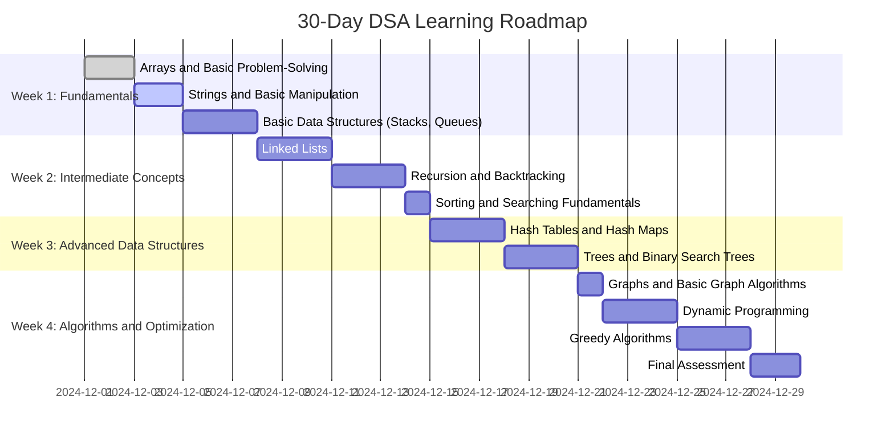

# 30-Day DSA Learning Roadmap

## Pre-Roadmap Preparation

### Rules for Learning:
1. No LLM/AI assistance for solving problems.
2. Solve problems independently.
3. Time-box your problem-solving (45-60 minutes per problem).
4. Always draw out your solution on paper first.
5. Learn to break down problems into smaller components.
6. Maintain a problem-solving journal.

### Learning Approach:
- Understand the problem completely.
- Design a solution on paper.
- Implement the solution.
- Optimize and analyze time/space complexity.
- Compare your solution with others after solving.

---

## Roadmap Visualization

---

## Week 1: Fundamentals and Basic Data Structures

### **Learning Objectives:**
- Develop foundational problem-solving skills.
- Understand and implement basic data structures like arrays, strings, stacks, and queues.

### **Day 1-2: Arrays and Basic Problem-Solving**
- **Milestone:** Solve 3 out of 4 problems independently; understand array traversal and manipulation.
- **Practice Problems:**
  1. [Two Sum](https://leetcode.com/problems/two-sum/) (LeetCode 1)
  2. [Remove Duplicates from Sorted Array](https://leetcode.com/problems/remove-duplicates-from-sorted-array/) (LeetCode 26)
  3. [Maximum Subarray](https://leetcode.com/problems/maximum-subarray/) (LeetCode 53)
  4. [Move Zeroes](https://leetcode.com/problems/move-zeroes/) (LeetCode 283)

### **Day 3-4: Strings and Basic Manipulation**
- **Milestone:** Solve 3 out of 4 problems independently; implement common string operations.
- **Practice Problems:**
  1. [Reverse String](https://leetcode.com/problems/reverse-string/) (LeetCode 344)
  2. [Reverse Integer](https://leetcode.com/problems/reverse-integer/) (LeetCode 7)
  3. [Valid Palindrome](https://leetcode.com/problems/valid-palindrome/) (LeetCode 125)
  4. [Longest Common Prefix](https://leetcode.com/problems/longest-common-prefix/) (LeetCode 14)

### **Day 5-7: Basic Data Structures - Stacks and Queues**
- **Milestone:** Understand stack and queue operations; solve 3 out of 4 problems.
- **Practice Problems:**
  1. [Valid Parentheses](https://leetcode.com/problems/valid-parentheses/) (LeetCode 20)
  2. [Implement Stack using Queues](https://leetcode.com/problems/implement-stack-using-queues/) (LeetCode 225)
  3. [Implement Queue using Stacks](https://leetcode.com/problems/implement-queue-using-stacks/) (LeetCode 232)
  4. [Min Stack](https://leetcode.com/problems/min-stack/) (LeetCode 155)

---

## Week 2: Intermediate Concepts

### **Learning Objectives:**
- Explore linked lists, recursion, and basic sorting/searching algorithms.
- Understand and implement recursive solutions and backtracking techniques.

### **Day 8-10: Linked Lists**
- **Milestone:** Understand linked list traversal and manipulation; solve 3 out of 4 problems.
- **Practice Problems:**
  1. [Reverse Linked List](https://leetcode.com/problems/reverse-linked-list/) (LeetCode 206)
  2. [Linked List Cycle](https://leetcode.com/problems/linked-list-cycle/) (LeetCode 141)
  3. [Merge Two Sorted Lists](https://leetcode.com/problems/merge-two-sorted-lists/) (LeetCode 21)
  4. [Palindrome Linked List](https://leetcode.com/problems/palindrome-linked-list/) (LeetCode 234)

### **Day 11-13: Recursion and Backtracking**
- **Milestone:** Solve at least 2 out of 4 problems using recursive thinking.
- **Practice Problems:**
  1. [Climbing Stairs](https://leetcode.com/problems/climbing-stairs/) (LeetCode 70)
  2. [Permutations](https://leetcode.com/problems/permutations/) (LeetCode 46)
  3. [Subsets](https://leetcode.com/problems/subsets/) (LeetCode 78)
  4. [Generate Parentheses](https://leetcode.com/problems/generate-parentheses/) (LeetCode 22)

### **Day 14: Sorting and Searching Fundamentals**
- **Milestone:** Understand basic sorting and searching algorithms; solve 3 out of 4 problems.
- **Practice Problems:**
  1. [Sort an Array](https://leetcode.com/problems/sort-an-array/) (LeetCode 912)
  2. [Search in Rotated Sorted Array](https://leetcode.com/problems/search-in-rotated-sorted-array/) (LeetCode 33)
  3. [Sqrt(x)](https://leetcode.com/problems/sqrtx/) (LeetCode 69)
  4. [Search a 2D Matrix](https://leetcode.com/problems/search-a-2d-matrix/) (LeetCode 74)

---

## Week 3: Advanced Data Structures

### **Learning Objectives:**
- Understand hash tables, trees, and basic graph algorithms.
- Solve problems that combine multiple data structures.

### **Day 15-17: Hash Tables and Hash Maps**
- **Milestone:** Solve at least 3 problems independently; understand hash map operations.
- **Practice Problems:**
  1. [Valid Anagram](https://leetcode.com/problems/valid-anagram/) (LeetCode 242)
  2. [Group Anagrams](https://leetcode.com/problems/group-anagrams/) (LeetCode 49)
  3. [First Unique Character in a String](https://leetcode.com/problems/first-unique-character-in-a-string/) (LeetCode 387)

### **Day 18-20: Trees and Binary Search Trees**
- **Milestone:** Solve 3 out of 4 problems; understand tree traversal and properties.
- **Practice Problems:**
  1. [Maximum Depth of Binary Tree](https://leetcode.com/problems/maximum-depth-of-binary-tree/) (LeetCode 104)
  2. [Validate Binary Search Tree](https://leetcode.com/problems/validate-binary-search-tree/) (LeetCode 98)
  3. [Lowest Common Ancestor of a Binary Tree](https://leetcode.com/problems/lowest-common-ancestor-of-a-binary-tree/) (LeetCode 236)
  4. [Binary Tree Level Order Traversal](https://leetcode.com/problems/binary-tree-level-order-traversal/) (LeetCode 102)

---

## Week 4: Algorithms and Optimization

### **Learning Objectives:**
- Understand graph algorithms, dynamic programming, and greedy approaches.
- Learn optimization techniques and improve problem-solving speed.

### **Day 21: Graphs and Basic Graph Algorithms**
- **Milestone:** Solve 3 out of 4 problems; understand graph traversal techniques.
- **Practice Problems:**
  1. [Number of Islands](https://leetcode.com/problems/number-of-islands/) (LeetCode 200)
  2. [Clone Graph](https://leetcode.com/problems/clone-graph/) (LeetCode 133)
  3. [Number of Provinces](https://leetcode.com/problems/number-of-provinces/) (LeetCode 547)
  4. [Max Area of Island](https://leetcode.com/problems/max-area-of-island/) (LeetCode 695)

### **Day 22-24: Dynamic Programming**
- **Milestone:** Solve at least 2 out of 4 problems using a dynamic programming approach.
- **Practice Problems:**
  1. [Unique Paths](https://leetcode.com/problems/unique-paths/) (LeetCode 62)
  2. [Coin Change](https://leetcode.com/problems/coin-change/) (LeetCode 322)
  3. [Longest Increasing Subsequence](https://leetcode.com/problems/longest-increasing-subsequence/) (LeetCode 300)
  4. [Longest Palindromic Substring](https://leetcode.com/problems/longest-palindromic-substring/) (LeetCode 5)

### **Day 25-27: Greedy Algorithms**
- **Milestone:** Understand when greedy approaches work; solve at least 2 problems.
- **Practice Problems:**
  1. [Jump Game](https://leetcode.com/problems/jump-game/) (LeetCode 55)
  2. [Jump Game II](https://leetcode.com/problems/jump-game-ii/) (LeetCode 45)

---

## Final Assessment
- Create a project report in your GitHub repository summarizing your journey.
- Reflect on solved problems and revisit unsolved ones.
- Share your progress with the programming community.

